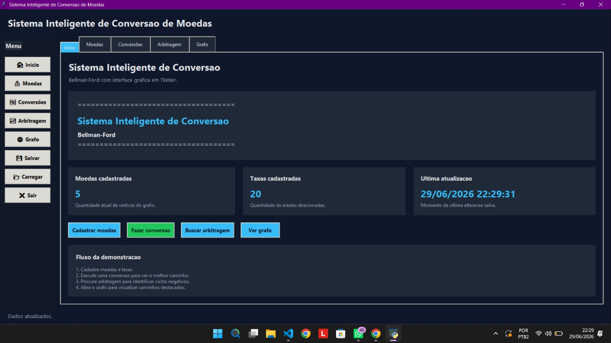
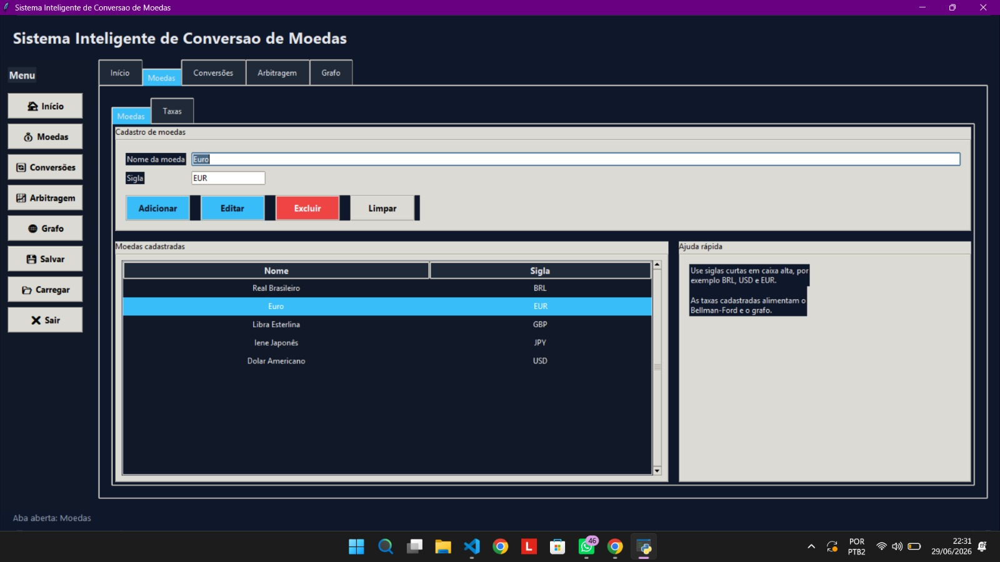
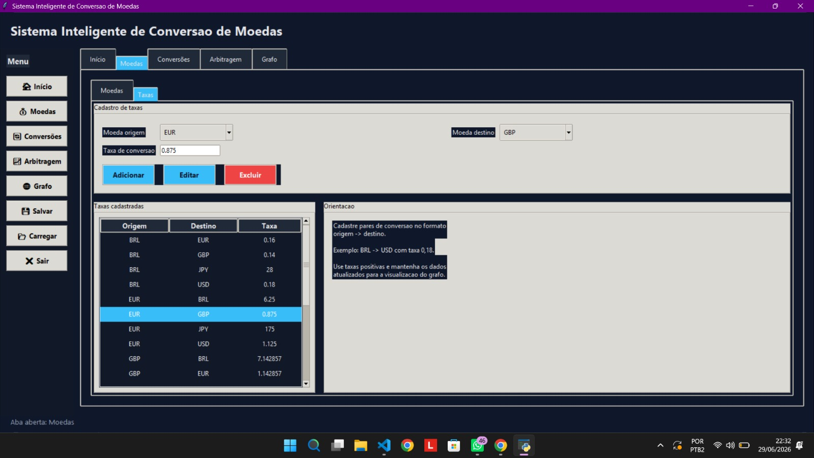
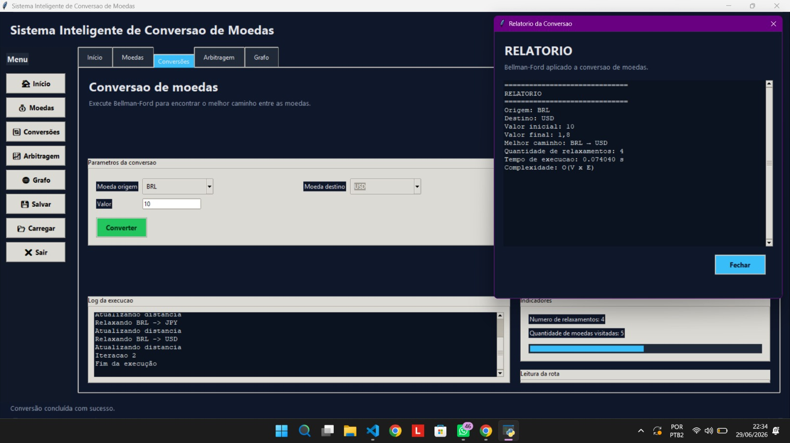
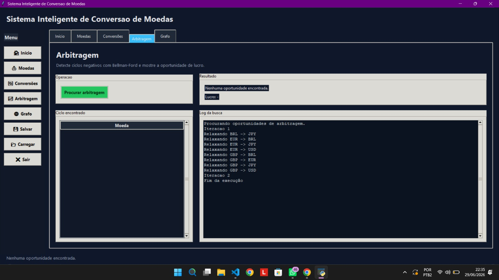
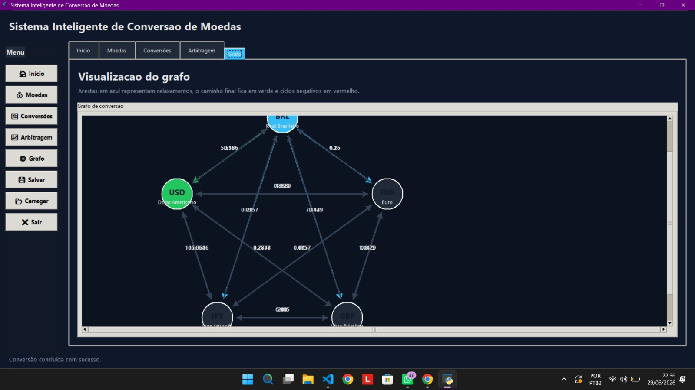

# Sistema Inteligente de Conversão de Moedas utilizando Bellman-Ford

**Número da Lista:** 22  
**Disciplina:** Projeto de Algoritmos

## Alunos

| Matrícula | Aluno |
|-----------|--------|
| 211061903 | Isaque Santos |
| 200023985 | Maria Eduarda dos Santos Marques |

## Sobre

Sistema desenvolvido em **Python**  para simular um mercado de câmbio usando o algoritmo **Bellman-Ford**.

O projeto permite cadastrar moedas, cadastrar e alterar taxas de conversão, realizar conversões entre moedas, detectar oportunidades de arbitragem e visualizar o grafo de relações entre as moedas. O algoritmo Bellman-Ford é implementado manualmente para encontrar o melhor caminho de conversão e identificar ciclos negativos.

A principal motivação para a escolha do Bellman-Ford foi sua capacidade de resolver o problema de menor caminho em grafos com pesos negativos, além de permitir a detecção de arbitragem em cenários de câmbio.

---

## Screenshots


<div align="center">

**Tela Início - Visao geral do sistema, com atalhos para cadastro, conversao, arbitragem e grafo.**



</div>

<div align="center">

**Tela Moedas - Cadastro e edicao de moedas registradas no sistema.**



</div>

<div align="center">

**Tela Taxas - Cadastro e manutencao das taxas de conversao entre moedas.**



</div>

<div align="center">

**Tela Conversoes - Execucao da conversao com relatorio do Bellman-Ford.**



</div>

<div align="center">

**Tela Arbitragem - Busca de ciclos negativos e oportunidades de lucro.**



</div>

<div align="center">

**Tela Grafo - Visualizacao das relacoes entre as moedas no grafo.**



</div>

### Vídeo do trabalho

[Clique aqui para assistir à demonstração](https://youtu.be/Ce6M4vTUFBE)

---

## Instalação

### Pré-requisitos

- Python 3.x
- Terminal ou Prompt de Comando

### Execução

Na raiz do projeto:

```bash
python main.py
```

---


## Algoritmo Utilizado

### Bellman-Ford

O algoritmo Bellman-Ford é usado para encontrar o melhor caminho entre moedas e para detectar ciclos negativos que representam oportunidades de arbitragem.


## Observações

- O sistema utiliza dados em JSON para persistência automática.
- O grafo exibe os caminhos encontrados e destaca conversões e ciclos negativos quando o algoritmo é executado.

---
